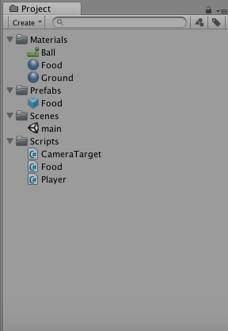
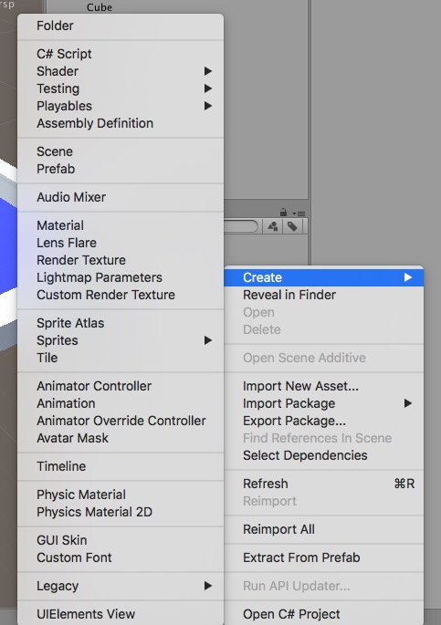
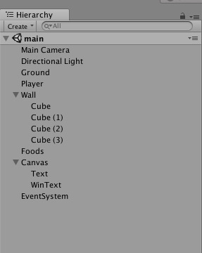
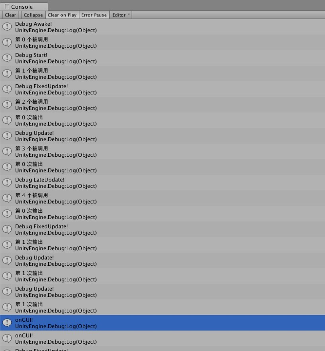
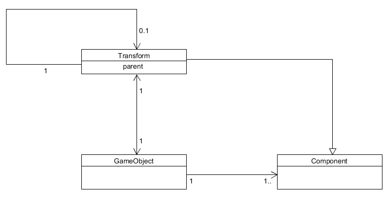

1）解释 游戏对象（GameObjects） 和 资源（Assets）的区别与联系
> 
> 区别
> <li>游戏对象 (GameObject)
> 游戏对象是所有其他组件 (Component) 的容器。游戏中的所有对象本质上都是游戏对象 。他们自身是不会向游戏添加任何特性的，我们需要为他们添加属性、添加各种组件来赋予他们各种功能。
> <li>资源(Assets)
> 资源就是一个工程里面你所需要用到的各种3d模型，音乐，图片，脚本文件，预设（prefab）等东西
>
>联系
><li> 资源可能会构成游戏对象的一个组件，或者赋予游戏对象某个属性，资源使得游戏对象的内在更加的丰富，使得我们看到的或者在游戏中控制的游戏对象更加的活灵活现

2）下载几个游戏案例，分别总结资源、对象组织的结构（指资源的目录组织结构与游戏对象树的层次结构）

> 游戏：Roll-A-Ball，**如下图所示结构，资源中可以放置图像、声音、脚本等**
>
> 
> 
>资源的目录组织结构基本包括Prefabs预设，Materials材料文件（你所会用到的所有的用于游戏对象身上的材质），Scenes场景文件，Scripts脚本代码文件；此外，通过下图
>
>
> 我们可以知道在资源结构里面可能还会有Sounds音效文件，Textures所有的贴图等等...
>
> **而下图是对象组织的结构**
> 
>
> 游戏对象树类似于父子继承关系，一个游戏对象往往是包括了多个子对象；


<li> 编写一个代码，使用 debug 语句来验证 MonoBehaviour 基本行为或事件触发的条件：
    -基本行为包括 Awake() Start() Update() FixedUpdate() LateUpdate()
    -常用事件包括 OnGUI() OnDisable() OnEnable()
    

```c#
using System.Collections;
using System.Collections.Generic;
using UnityEngine;
//一些注释来源于网上查询
public class Hello : MonoBehaviour {
	//Awake ->OnEable-> Start ->-> FixedUpdate-> Update  -> LateUpdate ->OnGUI ->OnDisable ->OnDestroy
	public int count = 0;//设置一个计数器来看一下他们被调用的顺序

	private bool islog1 = false;
	private bool islog2 = false;
	private bool islog3 = false;

	private int number1 = 0;
	private int number2 = 0;
	private int number3 = 0;
	void Awake(){
		Debug.Log ("Debug Awake!");
		Debug.Log ("第 " + count + " 个被调用");
		count++;
	}
	// Use this for initialization
	void Start () {
		Debug.Log ("Debug Start!");
		Debug.Log ("第 " + count + " 个被调用");
		count++;
	}
	
	// Update is called once per frame
	void Update () {
		//只在update第一次被调用的时候输出count
		if (!islog1 && number1 == 0) {
			Debug.Log ("Debug Update!");
			Debug.Log ("第 " + count + " 个被调用");
			Debug.Log ("第 " + number1 + " 次输出");
			count++;
			number1++;
			islog1 = true;
		} 
		else {
			Debug.Log ("Debug Update!");
			Debug.Log ("第 " + number1 + " 次输出");
			number1++;
		}
	}
	void FixedUpdate(){
		//只在Fixedupdate第一次被调用的时候输出count
		if (!islog2 && number2 == 0) {
			Debug.Log ("Debug FixedUpdate!");
			Debug.Log ("第 " + count + " 个被调用");
			Debug.Log ("第 " + number2 + " 次输出");
			count++;
			number2++;
			islog2 = true;
		} 
		else {
			Debug.Log ("Debug FixedUpdate!");
			Debug.Log ("第 " + number2 + " 次输出");
			number2++;
		}
	}
	void LateUpdate(){
		//只在lateupdate第一次被调用的时候输出count
		if (!islog3 && number3 == 0) {
			Debug.Log ("Debug LateUpdate!");
			Debug.Log ("第 " + count + " 个被调用");
			Debug.Log ("第 " + number3 + " 次输出");
			count++;
			number3++;
			islog3 = true;
		} 
		else {
			Debug.Log ("Debug Update!");
			Debug.Log ("第 " + number3 + " 次输出");
			number3++;
		}
	}
	//只要在控制脚本激活的情况下，OnGUI可以类似于Update函数一样在每帧进行调用
	void OnGUI()  
	{  
		Debug.Log("onGUI!");  
	}  
	//OnDisable：当物体被销毁时 OnDisable将被调用，并且可用于任意清理代码。脚本被卸载时，OnDisable将被调用，OnEnable在脚本被载入后调用
	void OnDisable()  
	{  
		Debug.Log("onDisable!");  
	}  
	//OnDestroy：当MonoBehaviour将被销毁时，这个函数被调用。OnDestroy只会在预先已经被激活的游戏物体上被调用
	void OnDestroy()  
	{  
		Debug.Log("onDestroy!");  
	}  

}
```
解释以上各函数调用
> 1.Awake：用于在游戏开始之前初始化变量或游戏状态。在脚本整个生命周期内它仅被调用一次.Awake在所有对象被初始化之后调用
>
> 2.Start：仅在Update函数第一次被调用前调用。Start在behaviour的生命周期中只被调用一次
>
> 3.FixedUpdate：固定帧更新，在Unity导航菜单栏中，点击“Edit”-->“Project Setting”-->“Time”菜单项后，右侧的Inspector视图将弹出时间管理器(默认频率为0.02s)
>
> 4.Update：正常帧更新，用于更新逻辑。每一帧都执行，处理Rigidbody时，需要用FixedUpdate代替Update。(这样会显得我们施加给刚体的力比较符合实际)
>
> 5.LateUpdate：在所有Update函数调用后被调用，和fixedupdate一样都是每一帧都被调用执行，这可用于调整脚本执行顺序
>
> 6.OnGUI：在渲染和处理GUI事件时调用
>
> 7.OnDisable：当物体被销毁时 OnDisable将被调用，并且可用于任意清理代码
>
> 8.OnDestroy：当MonoBehaviour将被销毁时，这个函数被调用. OnDestroy只会在预先已经被激活的游戏物体上被调用。
>实验过程如下图：
>
>

<li>查找脚本手册，了解 GameObject，Transform，Component 对象

1、分别翻译官方对三个对象的描述（Description）
><li>GameObject
>英：GameObjects are the fundamental objects in Unity that represent characters, props and scenery. They do not accomplish much in themselves but they act as containers for Components, which implement the real functionality.
>中：游戏中的每个对象都是一个游戏对象(GameObject)。然而，游戏对象(GameObjects)本身不做任何事情。他们类似于一个组件的容器，需要用一些使之生效的实际功能来填充它

><li> Transform
>英：The Transform component determines the Position, Rotation, and Scale of each object in the scene. Every GameObject has a Transform.
>中：转换组件决定了游戏场景中每个游戏对象的位置，旋转和缩放比例。每个游戏对象都有转换组件

><li>Component
>英：Components are the nuts & bolts of objects and behaviors in a game. They are the functional pieces of every GameObject.
>中：在游戏中，组件(Components)就是对象和行为的细节组成，它们是每个游戏对象 (GameObject)的功能部分

2、描述下图中 table 对象（实体）的属性、table 的 Transform 的属性、 table 的部件（本题目要求是把可视化图形编程界面与 Unity API 对应起来，当你在 Inspector 面板上每一个内容，应该知道对应 API。例如：table 的对象是 GameObject，第一个选择框是 activeSelf 属性）


> Table对象的属性：Tag属性用于区分游戏中不同类型的对象，顾名思义就是一个标签，我们可以把同一类元素归为同一个标签Tag。我们还可以用GameObject.FindWithTag("TagName")或者GameObject.FindGameobjectsWithTag("TagName")来查询对象。前者是返回一个某标签的一个对象，后者是返回该标签的所有查询到的对象。第一个选择框是activeSelf属性，勾选了就表示这个对象处于被激活的状态，否则就是未被激活（直观的理解就是不再屏幕上显示了，被隐藏了起来）。
>
>Table的Transform属性：Position（位置）、Rotation（旋转）、Scale（缩放）
>其中Table的Transform属性有Position X为0、Y为0、Z为0，Rotation X为0、Y为0、Z为0，Scale X为1、Y为1、Z为1。
>
>Table的部件：Mesh Filter（可在此部件里面修改某个对象的网格数据）、Box Collider（碰撞与触发组件）、Mesh Renderer（网格渲染，从这个部件中我们可以获取网格形状并通过mesh渲染）

<li>用 UML 图描述 三者的关系（请使用 UMLet 14.1.1 stand-alone版本出图）

> 

<li>整理相关学习资料，编写简单代码验证以下技术的实现：

1、查找对象

```c#
void Start () {
		var isfind1 = GameObject.Find ("chair1");//通过名字查找
		var isfind2 = GameObject.FindWithTag("chair1");//通过标签查找一个对象
		var isfind3 = GameObject.FindGameObjectsWithTag ("chair1");//通过标签查找一组对象
		var isfind4 = GameObject.FindObjectOfType("chair1");//通过类型查找一个对象
		var isfind5 = GameObject.FindObjectsOfType("chair1");//通过类型查找一组相同类型的对象
	}
```


2、添加子对象
```c#
GameObect CreatePrimitive(PrimitiveTypetype)  
```

3、遍历对象树
```c#
foreach (Transform child in transform) {  
          //code what you want
        };
```

4、清除所有子对象
只需在遍历对象树的基础上一个个的删除就行
```c#
foreach (Transform child in transform) {  
            Destroy(child.gameObject);
        };
```

<li>资源预设（Prefabs）与 对象克隆 (clone)

1、预设（Prefabs）有什么好处？
>预设类似于一个模板，通过预设可以创建相同属性的对象，这些对象和预设关联。一旦预设发生改变，所有通过预设实例化的对象都会产生相应的变化

2、预设与对象克隆 (clone or copy or Instantiate of Unity Object) 关系？
>预设可以使修改的复杂度降低，一旦需要修改所有相同属性的对象，只需要修改预设的属性即可，所有通过预设实例化的对象都会做出相应变化。而克隆只是复制一个一模一样的对象，比如说由A克隆出来了B，A和B这两个对象是相互独立的，对A的属性进行修改并不影响B的属性，反过来修改B也是。

3、制作 table 预制，写一段代码将 table 预制资源实例化成游戏对象
```c#
void Start () {
		Debug.Log ("Debug Start!");
		GameObject Instance = (GameObject)Instantiate (Table.gameObject);
		Instance.name = "newTable";
		Instance.transform.position = new Vector3 (1, 0, 0);
		Instance.transform.parent = this.transform;
	}
```

<li>尝试解释组合模式（Composite Pattern / 一种设计模式）

> 1）组合模式（Composite Pattern），又叫部分整体模式，是用于把一组相似的对象当作一个单一的对象。组合模式依据树形结构来组合对象，用来表示部分以及整体层次。这种类型的设计模式属于结构型模式，它创建了对象组的树形结构。这种模式创建了一个包含自己对象组的类。该类提供了修改相同对象组的方式。并且树形结构的对象组合表示出了“部分-整体”的层次结构。
>
> 2）使用 BroadcastMessage() 方法, 向子对象发送消息
> ```c#
> void receivemessage(){
>      Debug. Log("Got message from parent");
> }
> void start(){
>     this. BroadcastMessage("receivemessage");  
>}
> ```
