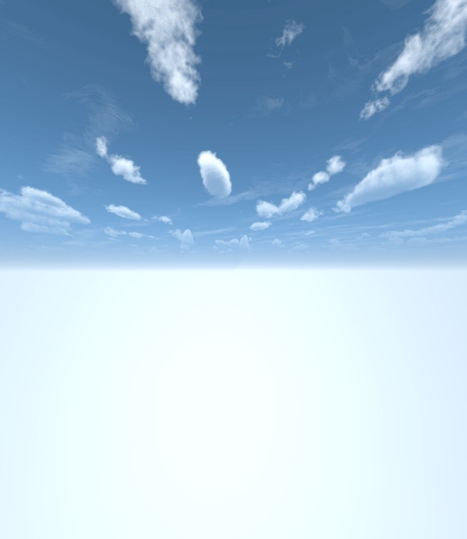

<li>skybox的使用</li>
商店里面下载skybox然后对主摄像机添加组件skybox，并把天空图片拖到组件图片栏里面即可

<li>写一个简单的总结，总结游戏对象的使用</li>

> 游戏对象是所有其他组件 (Component) 的容器。> 游戏中的所有对象本质上都是游戏对象 。他们自身> 是不会向游戏添加任何特性的，我们需要为他们添加> 属性、添加各种组件来赋予他们各种功能。